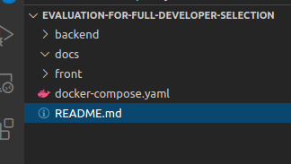

# Dev

Para executar o projeto na pasta raiz terá um arquivo docker-compose



```shell
.
├── backend
│   ├── Dockerfile
│   ├── evaluation-for-full-developer-selection.iml
│   ├── mvnw
│   ├── mvnw.cmd
│   ├── pom.xml
│   ├── src
│   └── target
├── docker-compose.yaml
├── docs
│   └── 01.png
├── front
│   ├── angular.json
│   ├── Dockerfile
│   ├── e2e
│   ├── karma.conf.js
│   ├── node_modules
│   ├── package.json
│   ├── package-lock.json
│   ├── protractor.conf.js
│   ├── src
│   ├── tsconfig.base.json
│   ├── tsconfig.json
│   └── tslint.json
└── README.md
```

Logo em seguida execute o comando `docker-compose up --build`

Acesse a url http://localhost:4200/